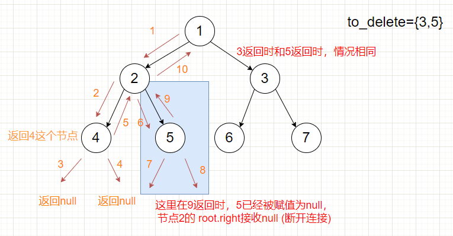
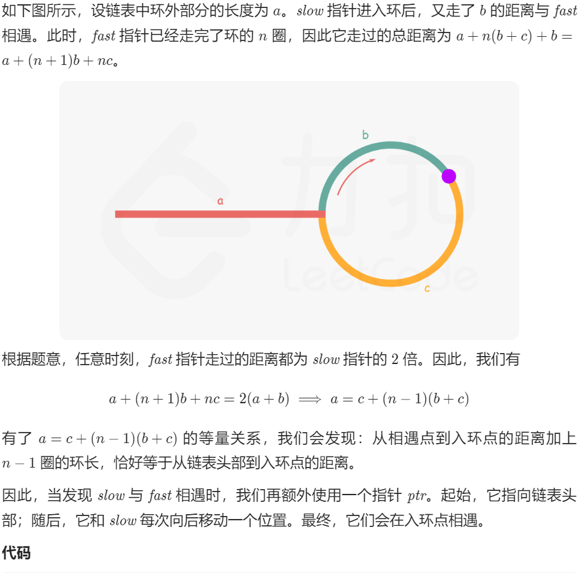

# 数组

## 414 第三大的数

### 方法一：有序集合

我们可以遍历数组，同时用一个有序集合来维护数组中前三大的数。具体做法是每遍历一个数，就将其插入有序集合，若有序集合的大小超过 3，就删除集合中的最小元素。这样可以保证有序集合的大小至多为 3，且遍历结束后，若有序集合的大小为 3，其最小值就是数组中第三大的数；若有序集合的大小不足 3，那么就返回有序集合中的最大值。

```cpp
#include <iostream>
using namespace std;
#include <string>
#include <vector>
#include <map>
#include <algorithm>
#include <numeric>
#include <functional>
#include <set>

void printVector(vector<int>& v) {
    for (vector<int>::iterator it = v.begin(); it != v.end(); it++) {
        cout << *it << " ";
    }
    cout << endl;
}

class Solution {
public:
    int thirdMax(vector<int>& nums) {
        set<int> s;
        for (int num : nums) {
            s.insert(num);
            //大于3时，就把左边第一个数擦除
            if (s.size() > 3) {
                s.erase(s.begin());
            }
        }
        return s.size() == 3 ? *s.begin() : *s.rbegin();
    }
};

int main()
{
    vector<int> ivec;
    int num;
    do
    {
        cin >> num;
        ivec.push_back(num);
    } while (getchar() != '\n');

    //printVector(ivec);

    Solution s;
    cout << s.thirdMax(ivec)<<endl;

    system("pause");
    return 0;
}
```

## 581 最短无序连续子数组

### 方法一：找无序列表下标的最大、最小值

从左向右，保存该过程的最大值，与当前值得max进行对比，如果小于说明已经到达了无序列表中了，就记录当前值，一直到有序列表为止，此时后半部分的有序列表中的第一个值，也要比前面的大或等于前面的最大值，记录下的位置就不会改动了

```cpp
#include <iostream>
using namespace std;
#include <string>
#include <vector>
#include <map>
#include <algorithm>
#include <numeric>
#include <functional>
#include <set>

void printVector(vector<int>& v) {
    for (vector<int>::iterator it = v.begin(); it != v.end(); it++) {
        cout << *it << " ";
    }
    cout << endl;
}

class Solution {
public:
    int findUnsortedSubarray(vector<int>& nums) {
        if (nums.size() <= 1) return 0;
        int len = nums.size(), low = 0, high = len - 1, maxNum = nums[0], minNum = nums[len - 1];
        for (int i = 1; i < len; i++) {
            maxNum = max(maxNum, nums[i]);
            minNum = min(minNum, nums[len - 1 - i]);
            //如果小于当前的最大值，说明到达了无序列表，记录当前值，一直到有序列表位置
            //后半部分的有序列表的第一个值，也要比前面大或等于前面的最大值
            if (nums[i] < maxNum) low = i;
            if (nums[len - 1 - i] > minNum) high = len - 1 - i;
        }
        return low > high ? low - high + 1 : 0;
    }
};

int main()
{
    vector<int> ivec;
    int num;
    do
    {
        cin >> num;
        ivec.push_back(num);
    } while (getchar() != '\n');

    printVector(ivec);

    Solution s;
    s.findUnsortedSubarray(ivec);
    cout << s.findUnsortedSubarray(ivec) << endl;;

    system("pause");
    return 0;
}
```

## 605 种花问题

### 方法一：连续三个0

```cpp
class Solution {
public:
    bool canPlaceFlowers(vector<int>& flowerbed, int n) {
        int flag = 0;
        //左右两端各增加一个0，不用考虑边界条件，任意位置处只要连续出现三个0就可以栽上一颗花
        flowerbed.insert(flowerbed.begin(), 0);
        flowerbed.push_back(0);
        for (int i = 0; i < flowerbed.size(); ++i) {
            if (flowerbed[i] == 0) {
                if (i + 1 < flowerbed.size() && i + 2 < flowerbed.size()) {
                    if (flowerbed[i + 1] == 0 && flowerbed[i + 2] == 0) {
                        //i多加1，移动两个位置
                        i = i + 1;  //因为每连续三个0，中间的那个0才是用来种花的，
                        //比如连续5个0的情况
                        flag += 1;
                    }
                }
            }
        }
        return flag >= n;
    }
};
```

## 628 三个数的最大乘积

### 方法一：排序

首先将数组排序。

如果数组中全是非负数，则排序后最大的三个数相乘即为最大乘积；如果全是非正数，则最大的三个数相乘同样也为最大乘积。

如果数组中有正数有负数，则最大乘积既可能是三个最大正数的乘积，也可能是两个最小负数（即绝对值最大）与最大正数的乘积。

综上，我们在给数组排序后，分别求出三个最大正数的乘积，以及两个最小负数与最大正数的乘积，二者之间的最大值即为所求答案。

```cpp
class Solution {
public:
    int maximumProduct(vector<int>& nums) {
        int product;
        int len = nums.size();
        sort(nums.begin(), nums.end());
        //如果数组中有正数有负数，则最大乘积既可能是三个最大正数的乘积，
        //也可能是两个最小负数（即绝对值最大）与最大正数的乘积。
        product = max(nums[0] * nums[1] * nums[len - 1], nums[len - 1] * nums[len - 2] * nums[len - 3]);
        return product;
    }
};
```

## 643 子数组的最大平均数

### 方法一：滑动窗口

不这么做会超时
//滑动窗口的方式，减去当前子数组的第一个数，加上子数组的后一个数
  sum = sum - nums[i - k] + nums[i];

```cpp
class Solution {
public:
    double findMaxAverage(vector<int>& nums, int k) {
        int len = nums.size();
        //先计算一次sum
        double sum = accumulate(nums.begin(), nums.begin() + k, 0);
        double maxAverage = sum / k;
        for (int i = k; i < len; ++i) {
            //然后滑动窗口的方式，减去当前子数组的第一个数，加上子数组的后一个数
            //不这么做会超时
            sum = sum - nums[i - k] + nums[i];
            double currentAverage = sum / k;
            maxAverage = max(currentAverage, maxAverage);
        }
        return maxAverage;
    }
};
```


# 字符串

## 12 罗马数字转整数

### 方法一：模拟

通常情况下，罗马数字中小的数字在大的数字的右边。若输入的字符串满足该情况，那么可以将每个字符视作一个单独的值，累加每个字符对应的数值即可。

```cpp 
#include <iostream>
using namespace std;
#include <string>
#include <vector>
#include <map>
#include <algorithm>
#include <numeric>
#include <functional>
#include <set>
#include <unordered_map>

class Solution {
public:
    int romanToInt(string s) {
        int ans = 0;
        int n = s.length();
        for (int i = 0; i < n; i++) {
            int value = symbolValues[s[i]];
            if (value < symbolValues[s[i + 1]]) {
                ans -= value;
            }
            else {
                ans += value;
            }
        }

        return ans;
    }

    unordered_map<char, int> symbolValues = {
        {'I', 1},
        {'V', 5},
        {'X', 10},
        {'L', 50},
        {'C', 100},
        {'D', 500},
        {'M', 1000},
    };

};

int main()
{
    string s;
    cin >> s;
    cout << s << endl;

    Solution ss;
    cout << ss.romanToInt(s) << endl;

    system("pause");
    return 0;
}
```

# 链表

## 21 合并两个有序链表

### 方法一：迭代（带头结点的版本，leetcode上不对）

```cpp
#include <iostream>
using namespace std;

//Definition for singly-linked list.
struct ListNode {
	int val;
	ListNode* next;
	ListNode() : val(0), next(nullptr) {}
	ListNode(int x) : val(x), next(nullptr) {}
	ListNode(int x, ListNode* next) : val(x), next(next) {}
};

//Definition for singly-linked list
class Solution {
public:
	ListNode* mergeTwoLists(ListNode* list1, ListNode* list2) {
		ListNode* p1 = list1->next; //指向list1的首元结点
		ListNode* p2 = list2->next; //指向list2的首元结点  
		ListNode* list3 = list1;    
		ListNode* p3 = list3; //指向头结点
		while (p1 && p2) {
			if (p1->val <= p2->val) {
				p3->next = p1; //从首元结点开始，而不是从头结点开始
				p3 = p3->next;
				p1 = p1->next;
			}
			else {
				p3->next = p2;
				p3 = p3->next;
				p2 = p2->next;
			}
		}
		//while循环执行完毕后，较长的链表还有余留一段元素，这段元素的起止地址就是pa或pb
		p3->next = (p1 ? p1 : p2);
		return list3;
	}
};

//尾插法创建不定长的单向链表
void createListTail(ListNode* L) {
	ListNode* r = L;
	do {
		ListNode* p = new ListNode;
		cin >> p->val;  //循环创建p，输入结点数据
		p->next = nullptr;
		r->next = p;
		r = p;
	} while (getchar() != '\n');
}

//输出链表元素
void printList(ListNode* L) {
	ListNode* p = L->next;
	while (p) {
		cout << p->val<<" ";
		p = p->next;
	}
	cout << endl;
}

int main()
{	
	ListNode* list1 = new ListNode;
	createListTail(list1);
	printList(list1);
	ListNode* list2 = new ListNode;
	createListTail(list2);
	printList(list2);

	Solution s;
	ListNode* list3 = s.mergeTwoLists(list1, list2);
	printList(list3);

	
	delete list2;
	delete list1;
	system("pause");
	return 0;
}
```

### 方法 一：迭代（不带头结点的版本，leetcode上是对的）

1. 创建一个空表list3
2. 一次从list1或list2中摘取元素值较小的结点插入到list3表的最后，直到其中一个表变空为止
3. 继续将list1或list2其中一个表的剩余结点插入到list3表的最后

leetcode上面的链表都是不带头结点

```cpp
/**
 * Definition for singly-linked list.
 * struct ListNode {
 *     int val;
 *     ListNode *next;
 *     ListNode() : val(0), next(nullptr) {}
 *     ListNode(int x) : val(x), next(nullptr) {}
 *     ListNode(int x, ListNode *next) : val(x), next(next) {}
 * };
 */
class Solution {
public:
	ListNode* mergeTwoLists(ListNode* list1, ListNode* list2) {
		ListNode* p1 = list1; //list1没有头结点
		ListNode* p2 = list2; //list2没有头结点
		ListNode* list3 = new ListNode;    
		ListNode* p3 = list3;  //list3有头结点
		while (p1 && p2) {
			if (p1->val <= p2->val) {
				p3->next = p1; 
				p3 = p3->next;
				p1 = p1->next;
			}
			else {
				p3->next = p2;
				p3 = p3->next;
				p2 = p2->next;
			}
		}
		//while循环执行完毕后，较长的链表还有余留一段元素，这段元素的起止地址就是pa或pb
		p3->next = (p1 ? p1 : p2);
		return list3->next; //返回list3->next，因为list3是带头结点，头结点中的val为0
	}
};
```

## 206 反转链表

### 方法一：迭代（leetcode上不带头结点的版本）

- 定义两个指针：prev和curr
- 每次让curr的next指向prev，实现一次局部反转

```cpp
#include <iostream>
using namespace std;

/// <summary>
/// 不带头结点
/// </summary>

struct ListNode {
	int val;
	ListNode* next;
	ListNode() : val(0), next(nullptr) {}
	ListNode(int x) : val(x), next(nullptr) {}
	ListNode(int x, ListNode* next) : val(x), next(next) {}
};


class Solution {
public:
	ListNode* reverseList(ListNode* head) {
		ListNode* prev = nullptr;
		//首先curr指向首元结点
		ListNode* curr = head;
		while (curr) {
			//利用next暂时存储curr结点的下一结点
			ListNode* next = curr->next;
			//curr的next指针域指向上次循环存储的prev前一结点
			curr->next = prev;
			//prev指向当前结点
			prev = curr;
			//curr指向下一结点
			curr = next;
		}
		return prev;
	}
};


//尾插法创建不定长的单向链表
void createListTail(ListNode* L) {
	ListNode* r = L;
	cin >> r->val;
	do {
		ListNode* p = new ListNode;
		cin >> p->val;  //循环创建p，输入结点数据
		p->next = nullptr;
		r->next = p;
		r = p;
	} while (getchar() != '\n');
}

//输出链表元素
void printList(ListNode* L) {
	ListNode* p = L;
	while (p) {
		cout << p->val << " ";
		p = p->next;
	}
	cout << endl;
}

int main()
{
	ListNode* list1 = new ListNode;
	createListTail(list1);
	printList(list1);

	Solution s;
	printList(s.reverseList(list1));

	delete list1;

	system("pause");
	return 0;
}
```

## 24 两两交换链表中的结点

### 方法一：迭代

```cpp
class Solution {
public:
	ListNode* swapPairs(ListNode* head) {
		//创建哑结点dummyHead，令dummyHead.next=head
		ListNode* dummyHead = new ListNode(0, head);
		//令temp表示当前到达的结点，初始化时temp=dummyHead
		ListNode* temp = dummyHead;
		ListNode* node1;
		ListNode* node2;
		//如果temp的后面没有结点或者只有一个结点，则结束交换
		while (temp->next && temp->next->next) { 
			//node1指向temp的下一结点，node2指向temp的下下个结点
			node1 = temp->next;
			node2 = temp->next->next;
			//两两交换
			//交换之前的节点关系是 temp -> node1 -> node2，
			//交换之后的节点关系要变成 temp -> node2 -> node1
			temp->next = node2;
			node1->next = node2->next;
			node2->next = node1;
			//令temp=node1
			temp = node1;
		}
		return dummyHead->next;
	}
};
```

## 160 相交链表

### 方法一：相交的话必在相交的起始点相遇

如果不相交，则相遇处为NULL

```cpp
class Solution {
public:
	// 设A的长度为a+c，B的长度为b+c；其中c为A、B的公共部分；
	// 拼接AB、BA：A+B=a+c+b+c B+A=b+c+a+c；由于a+c+b=b+c+a，因此二者必定在c的起始点处相遇
	ListNode* getIntersectionNode(ListNode* headA, ListNode* headB) {
		ListNode* curA = headA, * curB = headB;
		while (curA != curB) {
			// 每次判断当前点是否为空的好处是：避免A B无公共部分，
			// 再走完A+B和B+A后，会在nullptr处相遇
			curA = curA ? curA->next : headB;
			curB = curB ? curB->next : headA;
		}
		return curA;
	}
};
```

## 24 回文链表

### 方法一：复制到数组后采用双指针法

```cpp
#include <iostream>
using namespace std;
#include <vector>

/// <summary>
/// 不带头结点
/// </summary>


//Definition for singly-linked list.
struct ListNode {
	int val;
	ListNode* next;
	ListNode() : val(0), next(nullptr) {}
	ListNode(int x) : val(x), next(nullptr) {}
	ListNode(int x, ListNode* next) : val(x), next(next) {}
};


class Solution {
public:
	bool isPalindrome(ListNode* head) {
		vector<int> elem;
		ListNode* p = head;
		//将链表赋值到数组
		while (p) {
			elem.push_back(p->val);
			p = p->next;
		}

		//双指针法
		int low = 0, high = elem.size() - 1;
		while (low <= high) {
			//一旦前后指针搜索到的数组元素不相同，就返回false
			if (elem[low] != elem[high]) {
				return false;
			}
			//相同的话前后指针就继续移动
			else {
				++low;
				--high;
			}
		}
		//都相等就返回true
		return true;
	}
};

//尾插法创建不定长的单向链表
ListNode* createListTail() {
	ListNode* L= new ListNode;
	ListNode* r = L;
	cin >> r->val;
	do {
		ListNode* p = new ListNode;
		cin >> p->val;  //循环创建p，输入结点数据
		p->next = nullptr;
		r->next = p;
		r = p;
	} while (getchar() != '\n');
	return L;
}

//输出链表元素
void printList(ListNode* L) {
	ListNode* p = L;
	while (p) {
		cout << p->val << " ";
		p = p->next;
	}
	cout << endl;
}

int main()
{
	ListNode* list = createListTail();
	printList(list);

	Solution ss;
	cout << boolalpha << ss.isPalindrome(list) << endl;


	system("pause");
	return 0;
}
```

# 哈希表

## 202 快乐数


# 栈

## 155 最小栈

### 方法一：双栈（stack容器）

用stack容器创建两个栈，一个栈用来存储实际元素，一个栈用来存储最小元素

```cpp
#include <iostream>
using namespace std;
#include <stack>
#include <algorithm>


class MinStack {
public:
    MinStack() {
        min_stack.push(INT_MAX); //min_stack先初始化一个无穷大的数
    }

    void push(int x) {
        x_stack.push(x);
        min_stack.push(min(min_stack.top(), x)); //min_stack的栈顶元素一直是最小的
    }

    void pop() {
        x_stack.pop();
        min_stack.pop();
    }

    int top() {
        return x_stack.top();
    }

    int getMin() {
        return min_stack.top();
    }

private:
    stack<int> x_stack;
    stack<int> min_stack;
};
/**
 * Your MinStack object will be instantiated and called as such:
 * MinStack* obj = new MinStack();
 * obj->push(val);
 * obj->pop();
 * int param_3 = obj->top();
 * int param_4 = obj->getMin();
 */
```

## 225 用队列实现栈

### 方法一：两个队列（queue容器）

通过一个辅助queue容器q2，将后插入的元素排到队头，而不是队尾

```cpp
#include <iostream>
using namespace std;
#include <queue>


class MyStack {
public:
    MyStack() {

    }

    void push(int x) {
        //q2用于辅助
        //queue容器是队列，先进先出
        //通过这种方式将后入的元素排到队头
        q2.push(x);
        while (!q1.empty()) {
            q2.push(q1.front());
            q1.pop();
        }
        swap(q1, q2);
    }

    int pop() {
        int r = q1.front();
        //pop是队头的元素
        q1.pop();
        return r;
    }

    int top() {
        int r = q1.front();
        return r;
    }

    bool empty() {
        return q1.empty();
    }
private:
    queue<int> q1;
    queue<int> q2;
};
```

# 树

## 104 求二叉树的最大深度

### 方法一：递归调用

```cpp
#include <iostream>
using namespace std;
#include <vector>
#include <queue>

// Definition for a binary tree node.
 struct TreeNode {
     int val;
     TreeNode *left;
     TreeNode *right;
     TreeNode() : val(0), left(nullptr), right(nullptr) {}
     TreeNode(int x) : val(x), left(nullptr), right(nullptr) {}
     TreeNode(int x, TreeNode *left, TreeNode *right) : val(x), left(left), right(right) {}
 };
 
class Solution {
public:
    int maxDepth(TreeNode* root) {
        if (!root) {
            return 0;
        }
        int m = maxDepth(root->left);
        int n = maxDepth(root->right);
        if (m > n) {
            return m + 1;
        }
        else {
            return n + 1;
        }
    }
};


//根据数组，层次法创建二叉树
TreeNode* createTree(vector<int>& l_nums, int i) //层次法创建二叉树
{
    if (i >= l_nums.size() || l_nums[i] == 0) //数值为0或超出数组范围
        return nullptr;
    TreeNode* root = new TreeNode(l_nums[i]);
    root->left = createTree(l_nums, i * 2 + 1);
    root->right = createTree(l_nums, i * 2 + 2);
    return root;
}


int main()
{
    vector<int> nums = { 3,9,20,0,0,15,7 };
    TreeNode* root = createTree(nums, 0);
    
    Solution ss;
    cout << ss.maxDepth(root) << endl;

    system("pause");
    return 0;
}
```

## 110 平衡二叉树

### 方法一：自顶向下递归

```cpp
class Solution {
public:
	int height(TreeNode* root) {
		if (root == NULL) {
			return 0;
		}
		else {
			//获取当前子树的深度
			return max(height(root->left), height(root->right)) + 1;
		}
	}

	bool isBalanced(TreeNode* root) {
		if (root == NULL) {
			return true;
		}
		else {
			//左右子树的深度差皆满足条件
			return abs(height(root->left) - height(root->right)) <= 1 && isBalanced(root->left) && isBalanced(root->right);
		}
	}
};
```

## 543 二叉树的直径

### 方法一：递归

```cpp
class Solution {
public:
	int maxDepth = 0;
    int diameterOfBinaryTree(TreeNode* root) {
		depth(root);
		return maxDepth;
    }

	int depth(TreeNode* node) {
		if (!node) {
			return 0;
		}
		int left = depth(node->left);
		int right = depth(node->right);
		//将每个节点最大直径（左子树深度+右子树深度）与当前最大值比较并取较大者
		maxDepth = max(left + right, maxDepth);
		//返回节点深度
		return max(left, right) + 1;
	}
};
```

## 437 路径总和III

### 方法一：深度优先搜索，递归

```C++
class Solution {
public:
	int pathSum(TreeNode* root, int targetSum) {
		if (root) {
			return pathSumStartWithRoot(root, targetSum) + 
				pathSum(root->left, targetSum) + pathSum(root->right, targetSum);
		}
		else {
			return 0;
		}
	}

	long long pathSumStartWithRoot(TreeNode* root, long long sum) {
		if (!root) {
			return 0;
		}

		long long count;
		if (root->val == sum) {
			count = 1;
		}
		else {
			count = 0;
		}

		count += pathSumStartWithRoot(root->left, sum - root->val);
		count += pathSumStartWithRoot(root->right, sum - root->val);
		return count;
	}
};
```

## 101 对称二叉树

### 方法一：递归

```c++
#include <iostream>
using namespace std;
#include <vector>
#include <queue>

// Definition for a binary tree node.
struct TreeNode {
	int val;
	TreeNode* left;
	TreeNode* right;
	TreeNode() : val(0), left(nullptr), right(nullptr) {}
	TreeNode(int x) : val(x), left(nullptr), right(nullptr) {}
	TreeNode(int x, TreeNode* left, TreeNode* right) : val(x), left(left), right(right) {}
};


class Solution {
public:
	bool isSymmetric(TreeNode* root) {
		if (root) {
			return isSymmetric(root->left, root->right);
		}
		else{
			return true;
		}
	}

	bool isSymmetric(TreeNode* left, TreeNode* right) {
		//如果两个子树都为空指针，则它们相等或对称
		if (!left && !right) {
			return true;
		}
		//如果两个子树只有一个为空指针，则它们不相等或不对称
		if (!left || !right) {
			return false;
		}
		//如果两个子树根结点的值不相等，则它们不相等或不对称
		if (left->val != right->val) {
			return false;
		}
		return isSymmetric(left->left, right->right) && isSymmetric(left->right, right->left);
	}
};


//根据数组，层次法创建二叉树
TreeNode* createTree(vector<int>& l_nums, int i) //层次法创建二叉树
{
	if (i >= l_nums.size() || l_nums[i] == 0) //数值为0或超出数组范围
		return nullptr;
	TreeNode* root = new TreeNode(l_nums[i]);
	root->left = createTree(l_nums, i * 2 + 1);
	root->right = createTree(l_nums, i * 2 + 2);
	return root;
}

//层次遍历，迭代法
void levelOrderIter(TreeNode* root) {
	queue<TreeNode*> que;
	que.push(root);
	while (!que.empty()) {
		cout << que.front()->val << " ";
		if (que.front()->left != nullptr) {
			que.push(que.front()->left);
		}
		if (que.front()->right != nullptr) {
			que.push(que.front()->right);
		}
		que.pop();
	}
	cout << endl;
}


int main()
{
	vector<int> nums = { 1,2,2,0,3,0,3 };
	TreeNode* root = createTree(nums, 0);
	levelOrderIter(root);

	Solution ss;
	cout << boolalpha << ss.isSymmetric(root) << endl;


	system("pause");
	return 0;
}
```

## 1110 删点成林

### 方法一：递归



构造一个helper辅助函数：对于一个root结点，如果是它是要被删除的结点，则向forest中添加其左右孩子，并将其置为null后返回，使其断开与其父结点之前的连接

```cpp
class Solution {
public:
	vector<TreeNode*> delNodes(TreeNode* root, vector<int>& to_delete) {
		vector<TreeNode*> forest;
		//容器元素都互不相等
		unordered_set<int> dict(to_delete.begin(), to_delete.end());
		root = helper(root, dict, forest);
		if (root) {
			//最后再将删除结点后的树放入forest中
			forest.push_back(root);
		}
		return forest;
	}

	TreeNode* helper(TreeNode* root, unordered_set<int>& dict, vector<TreeNode*>& forest) {
		if (!root) {
			return root;
		}
		root->left = helper(root->left, dict, forest);
		root->right = helper(root->right, dict, forest);
		if (dict.count(root->val)) {
			//被删除结点如果有左右子树就放入forest中
			if (root->left) {
				forest.push_back(root->left);
			}
			if (root->right) {
				forest.push_back(root->right);
			}
			//被删除的结点置为空
			root = NULL;
		}
		return root;
	}
};
```

## 637 二叉树的层平均值

### 方法一：广度优先搜索，层次遍历法

```cpp
class Solution {
public:
	vector<double> averageOfLevels(TreeNode* root) {
		vector<double> ans;
		if (!root) {
			return ans;
		}
		queue<TreeNode*> q;
		q.push(root);
		while (!q.empty()) {
			//q的大小为上一次循环压入的某一层的结点总个数
			int count = q.size();
			double sum = 0;
			for (int i = 0; i < count; ++i) {
				TreeNode* node = q.front();
				q.pop();
				//q.size()次循环，获取到某一层结点值的总和
				sum += node->val;
				if (node->left) {
					q.push(node->left);
				}
				if (node->right) {
					q.push(node->right);
				}
			}
			ans.push_back(sum / count);
		}
		return ans;
	}
};
```

## 105 从前序与中序遍历序列构造二叉树

方法一：

# 最简单的贪心算法

## 445 分发饼干

### 方法一：贪心

- 因为饥饿度最小的孩子最容易吃饱，所以我们先考虑这个孩子。
- 为了尽量使得剩下的饼干可以满足饥饿度更大的孩子，所以我们应该把大于等于这个孩子饥饿度的、且大小最小的饼干给这个孩子。
- 满足了这个孩子之后，我们采取同样的策略，考虑剩下孩子里饥饿度最小的孩子，直到没有满足条件的饼干存在。

总结：给剩余孩子里最小饥饿度的孩子分配最小的能饱腹的饼干。

```cpp
#include <iostream>
using namespace std;
#include <vector>
#include <algorithm>

vector<int> createVector() {
	vector<int> ivec;
	int num;
	do
	{
		cin >> num;
		ivec.push_back(num);
	} while (getchar() != '\n');
	return ivec;
}

void printVector(vector<int>& v) {
	for (vector<int>::iterator it = v.begin(); it != v.end(); it++) {
		cout << *it << " ";
	}
	cout << endl;
}

class Solution {
public:
	int findContentChildren(vector<int>& g, vector<int>& s) {
		sort(g.begin(), g.end()); //排序方便之后的大小比较
		sort(s.begin(), s.end());
		int count = 0;
		int child = 0, cookie = 0;
		while (child < g.size() && cookie < s.size()) {
			if (g[child] <= s[cookie]) {
				++child;
				++count;
			}
			++cookie;
		}
		return count;
	}
};


int main()
{
	vector<int> g, s;
	g = createVector();
	s = createVector();

	Solution ss;
	cout << ss.findContentChildren(g, s) << endl;;

	system("pause");
	return 0;
}
```

## 135  分发糖果

### 方法一：贪心策略

- 把所有孩子的糖果数初始化为1；
- 先从左往右遍历一遍，如果右边孩子的评分比左边的高，则右边孩子的糖果数更新为左边孩子的糖果数加 1；
- 再从右往左遍历一遍，如果左边孩子的评分比右边的高，且左边孩子当前的糖果数不大于右边孩子的糖果数，则左边孩子的糖果数更新为右边孩子的糖果数加 1。

```cpp
//第一次自己按照思路写出来
#include <iostream>
using namespace std;
#include <vector>
#include <algorithm>
#include <numeric>

vector<int> createVector() {
	vector<int> ivec;
	int num;
	do
	{
		cin >> num;
		ivec.push_back(num);
	} while (getchar() != '\n');
	return ivec;
}

void printVector(vector<int>& v) {
	for (vector<int>::iterator it = v.begin(); it != v.end(); it++) {
		cout << *it << " ";
	}
	cout << endl;
}

class Solution {
public:
	int candy(vector<int>& ratings) {
		vector<int> candyNum;
		int len = ratings.size(); //获取孩子总数
		//将所有孩子的糖果数初始化为1
		for (int i = 0; i < len; ++i) {
			candyNum.push_back(1); 
		}
		//先从左往右遍历一遍，如果右边孩子的评分比左边的高，
		//则右边孩子的糖果数更新为左边孩子的糖果数加 1；
		for (int i = 1; i < len; ++i) {
			if (ratings[i] > ratings[i - 1]) {
				candyNum[i] = candyNum[i - 1] + 1;
			}
		}
		//再从右往左遍历一遍，如果左边孩子的评分比右边的高，
		//且左边孩子当前的糖果数不大于右边孩子的糖果数，
		//则左边孩子的糖果数更新为右边孩子的糖果数加 1。
		for (int i = len - 1; i >= 1; --i) {
			if (ratings[i - 1] > ratings[i] && candyNum[i-1]<=candyNum[i]) {
				candyNum[i - 1] = candyNum[i] + 1;
			}
		}
		//计算candyNum容器内糖果的总数，accumulate函数在<numeric>中
		int total = accumulate(candyNum.begin(), candyNum.end(), 0);
		return total;
	}
};

int main()
{
	vector<int> ratings;
	ratings = createVector();

	Solution ss;
	cout << ss.candy(ratings) << endl;

	system("pause");
	return 0;
}
```

leetcode101-高畅

```cpp
int candy(vector<int>& ratings) {
	int size = ratings.size();
	if (size < 2) {
		return size;
	}
	vector<int> num(size, 1); //vector容器构造函数，将size个1拷贝给本身
	for (int i = 1; i < size; ++i) {
		if (ratings[i] > ratings[i - 1]) {
			num[i] = num[i - 1] + 1;
		}
	}
	for (int i = size - 1; i > 0; --i) {
		if (ratings[i] < ratings[i - 1]) {
			num[i - 1] = max(num[i - 1], num[i] + 1);
		}
	}
	// std::accumulate可以很方便地求和
	return accumulate(num.begin(), num.end(), 0);
}
```

## 435 无重叠区间

### 方法一：贪心策略

​		求最少的移除区间个数，等价于尽量多保留不重叠的区间。在选择要保留区间时，区间的结尾十分重要：选择的区间结尾越小，余留给其它区间的空间就越大，就越能保留更多的区间。
因此，我们采取的贪心策略为，**优先保留结尾小且不相交的区间**。

- 先把区间按照结尾的大小进行增序排序
- 每次选择结尾最小且和前一个选择的区间不重叠的区间

```cpp
#include <iostream>
using namespace std;
#include <vector>
#include <algorithm>
#include <numeric>

//vector容器嵌套容器的打印
void printVectorInVector(vector<vector<int>>& v) {
	//通过大容器，把所有数据遍历一遍
	for (vector<vector<int>>::iterator it = v.begin(); it != v.end(); it++) {
		//(*it) ---- 容器 vector<int>
		for (vector<int>::iterator vit = (*it).begin(); vit != (*it).end(); vit++) {
			cout << *vit << " ";
		}
		cout << endl;
	}
	//每一个小容器输出，输出完了做一个换行的操作
}

//按照谓词（函数对象，仿函数）的方式传入sort进行自定义排序
class myCompare {
public:
	//先把区间按照结尾的大小进行增序排序
	bool operator()(vector<int>& a, vector<int>& b) {
		return a[1] < b[1]; //[1]取出区间的结尾
	}
};

class Solution {
public:
	int eraseOverlapIntervals(vector<vector<int>>& intervals) {
		if (intervals.empty()) {
			return 0;
		}
		int n = intervals.size();
		//sort传入谓词myCompare()，把区间按照结尾的大小进行增序排序
		sort(intervals.begin(), intervals.end(), myCompare());
		//prev初始化为第0个区间的结尾
		int removed = 0, prev = intervals[0][1];
		for (int i = 1; i < n; ++i) {
			//如果下一个区间的开头大于上一个区间的结尾，说明有重叠，++removed
			if (intervals[i][0] < prev) {
				++removed;
			}
			else {
				prev = intervals[i][1];
			}
		}
		return removed;
	}
};

int main()
{
	vector<vector<int>> intervals = { {1, 2},{2, 3},{3, 4},{1, 3} };
	printVectorInVector(intervals);

	Solution ss;
	cout << ss.eraseOverlapIntervals(intervals) << endl;

	system("pause");
	return 0;
}


```


leetcode101-高畅

```cpp
class Solution {
public:
	int eraseOverlapIntervals(vector<vector<int>>& intervals) {
		if (intervals.empty()) {
			return 0;
		}
		int n = intervals.size();
		sort(intervals.begin(), intervals.end(), [](vector<int>& a, vector<int>& b)
			{	//使用C++的lambda，结合std::sort()函数进行自定义排序
				return a[1] < b[1];
			});
		int removed = 0, prev = intervals[0][1];
		for (int i = 1; i < n; ++i) {
			if (intervals[i][0] < prev) {
				++removed;
			}
			else {
				prev = intervals[i][1];
			}
		}
		return removed;
	}
};
```

# 双指针

## 167 两数之和II-输入有序数组

### 方法一：排序数组，双指针遍历方向相反

​		因为数组已经排好序，我们可以采用方向相反的双指针来寻找这两个数字，一个初始指向最小的元素，即数组最左边，向右遍历；一个初始指向最大的元素，即数组最右边，向左遍历。

- 如果两个指针指向元素的和等于给定值，那么它们就是我们要的结果。
- 如果两个指针指向元素的和小于给定值，我们把左边的指针右移一位，使得当前的和增加一点。如果两个指针指向元素的和大于给定值，我们把右边的指针左移一位，使得当前的和减少一点。

​		可以证明，对于排好序且有解的数组，双指针一定能遍历到最优解。证明方法如下：假设最优解的两个数的位置分别是 l和 r。我们假设在左指针在 l左边的时候，右指针已经移动到了 r；此时两个指针指向值的和小于给定值，因此左指针会一直右移直到到达 l。同理，如果我们假设在右指针在 r右边的时候，左指针已经移动到了 l；此时两个指针指向值的和大于给定值，因此右指针会一直左移直到到达 r。所以双指针在任何时候都不可能处于 (l,r)之间，又因为不满足条件时指针必须移动一个，所以最终一定会收敛在 l和 r

```cpp
#include <iostream>
using namespace std;
#include <vector>
#include <algorithm>

vector<int> createVector() {
	vector<int> ivec;
	int num;
	do
	{
		cin >> num;
		ivec.push_back(num);
	} while (getchar() != '\n');
	return ivec;
}

void printVector(vector<int>& v) {
	for (vector<int>::iterator it = v.begin(); it != v.end(); it++) {
		cout << *it << " ";
	}
	cout << endl;
}

class Solution {
public:
	vector<int> twoSum(vector<int>& numbers, int target) {
		//l一开始在最左边，r在最右边
		int l = 0, r = numbers.size() - 1, sum;
		while (l < r) {
			sum = numbers[l] + numbers[r];
			if (sum == target) { //两个指针指向元素的和等于给定值，结束
				break;
			}
			if (sum < target) { //如果小了，左指针往右移
				++l;
			}
			else { //如果大了，右指针往左移
				--r;
			}
		}
		return vector<int>{ l + 1,r + 1 }; //因为下标从1开始，多加1
	}
};


int main()
{
	vector<int> numbers;
	numbers = createVector();
	int target;
	cin >> target;

	Solution ss;
	vector<int> result = ss.twoSum(numbers, target);
	cout << result[0] <<" "<<result[1] << endl;;

	system("pause");
	return 0;
}
```

## 88 合并两个有序数组

### 方法一：双指针

每次从两个数组的头部取出比较小的数字放到结果中

```cpp
#include <iostream>
using namespace std;
#include <vector>
#include <algorithm>

vector<int> createVector() {
	vector<int> ivec;
	int num;
	do
	{
		cin >> num;
		ivec.push_back(num);
	} while (getchar() != '\n');
	return ivec;
}

class Solution {
public:
	void merge(vector<int>& nums1, int m, vector<int>& nums2, int n) {
		//双指针
		int p1 = 0, p2 = 0;
		//创建一个新的数组，暂存排好序的数
		int *sorted=new int[m + n];
		int cur;
		while (p1 < m || p2 < n) {
			if (p1 == m) {
				cur = nums2[p2++];
			}
			else if (p2 == n) {
				cur = nums1[p1++];
			}
			else if (nums1[p1] < nums2[p2]) {
				cur = nums1[p1++];
			}
			else {
				cur = nums2[p2++];
			}
			sorted[p1 + p2 - 1] = cur;
		}
		//降排好序的数组赋给nums1
		for (int i = 0; i < m + n; ++i) {
			nums1[i] = sorted[i];
		}
		delete[] sorted;
	}
};

int main()
{
	vector<int> nums1, nums2;
	int m, n;
	nums1 = createVector();
	cin >> m;
	nums2 = createVector();
	cin >> n;

	Solution ss;
	ss.merge(nums1, m, nums2, n);

	for (int i = 0; i < m + n; ++i) {
		cout << nums1[i] << " ";
	}

	system("pause");
	return 0;
}
```


## 142 环形链表II

### 方法一：快慢指针

对于链表找环路的问题，有一个通用的解法——快慢指针（Floyd判圈法）。

- 给定两个指针，分别命名为 slow和 fast，起始位置在链表的开头。
- 每次 fast前进两步，slow前进一步。如果 fast可以走到尽头，那么说明没有环路；
- 如果 fast可以无限走下去，那么说明一定有环路，且一定存在一个时刻 slow和 fast相遇。
- 当 slow和 fast第一次相遇时，我们将 fast重新移动到链表开头，并让 slow和 fast每次都前进一步。当 slow和 fast第二次相遇时，相遇的节点即为环路的开始点 



```cpp
class Solution {
public:
	ListNode* detectCycle(ListNode* head) {
		ListNode* slow = head, * fast = head;
		//判断还是否存在环路
		do {
			//如果存在fast为空，或者fast->next为空的情况，
			//说明fast可以走到尽头，就说明没有环路
			if (!fast || !fast->next) {
				return nullptr;
			}
			//每次fast前进两步，slow前进一步
			fast = fast->next->next;
			slow = slow->next;
		} while (fast != slow); //如果存在环路，一定存在一个时刻slow和fast相遇
		//当slow和first第一次相遇时，将fast重新移动到链表开头
		fast = head;
		while (fast != slow) { //当slow和fast第二次相遇时，相遇的节点即为环路的开始点
			//让slow和fast每次都前进一步
			slow = slow->next;
			fast = fast->next;
		}
		return fast;
	}
};
```

## 76 最小覆盖子串

### 方法一：滑动窗口

滑动窗口机制，一个用于【延伸】现有窗口的r指针，一个用于【收缩】窗口的l指针，在任意时刻，只有一个指针运动，而另一个保持静止。

**我们在 s 上滑动窗口，通过移动 r 指针不断扩张窗口。当窗口包含 t 全部所需的字符后，如果能收缩，我们就收缩窗口直到得到最小窗口。**

使用长度为128的数组来映射字符，其中chars表示目前每个字符缺少的数量，flag表示每个字符中是否在t中存在

```cpp
class Solution {
public:
	string minWindow(string S, string T) {
		vector<int> chars(128, 0);
		vector<bool> flag(128, false);
		//先统计T中的字符情况
		for (int i = 0; i < T.size(); ++i) {
			flag[T[i]] = true; //在flag中，将t字符串中字母对应的ASCII码位置为true
			++chars[T[i]]; //在chars中，将t字符串中字母对应的ASCII位上，统计相应字母的个数s
		}
		//移动滑动窗口，不断更改统计数据
		int cnt = 0, l = 0, min_l = 0, min_size = S.size() + 1;
		for (int r = 0; r < S.size(); ++r) {
			if (flag[S[r]]) {
				//对应的字母个数减1s
				if (--chars[S[r]] >= 0) {
					//cnt++，表示有一个相符
					++cnt;
				}
				//若目前滑动窗口已包含T中全部字符，
				//则尝试将l右移，在不影响结果的情况下获得最短子字符串
				while (cnt == T.size()) {
					if (r - l + 1 < min_size) {
						min_l = l;
						min_size = r - l + 1;
					}
					if (flag[S[l]] && ++chars[S[l]] > 0) {
						--cnt;
					}
					++l;
				}
			}
		}
		return min_size > S.size() ? "" : S.substr(min_l, min_size);
	}
};
```

## 202 快乐数

### 方法一：快慢指针

快指针每次走两步，慢指针每次走一步，当二者相等时，即为一个循环周期。循环结束后，判断是不是1，是的话就是快乐数，否则不是快乐数。

```cpp
class Solution {
public:
	int bitSquareSum(int n) {
		int sum = 0;
		while (n > 0) {
			int bit = n % 10;
			sum += bit * bit;
			n = n / 10;
		}
		return sum;
	}

	bool isHappy(int n) {
		int slow = n, fast = n;
		do {
			slow = bitSquareSum(slow);
			fast = bitSquareSum(fast);
			fast = bitSquareSum(fast);
		} while (slow != fast);

		return slow == 1;
	}
};
```


# 二分查找

## 69 x的平方根

### 方法一：二分查找

```cpp
//最简单的的题目有自己做出来
class Solution {
public:
	int mySqrt(int x) {
		long low = 1, high = x; //防止int越界，long的取值范围大一点
		while (low <= high) {
			long mid = (low + high) / 2;
			if (mid* mid <= x) {
				if ((mid + 1) * (mid + 1) > x) {
					return mid; //此时的mid的平方小于等于x，但是加1后会大于x
				}
				
			}
			if (mid * mid < x) { 
				low = mid + 1;
			}
			if (mid * mid > x) {
				high = mid - 1;
			}
		}
		return 0;
	}
};
```

## 34 在排序数组中查找元素的第一个和最后一个位置

### 方法 一：二分查找

找数组中【第一个等于target的位置】和【第一个大于target的位置减一】

```cpp
#include <iostream>
using namespace std;
#include <vector>

vector<int> createVector() {
	vector<int> ivec;
	int num;
	do
	{
		cin >> num;
		ivec.push_back(num);
	} while (getchar() != '\n');
	return ivec;
}

class Solution {
public:
	vector<int> searchRange(vector<int>& nums, int target) {
		//找第一个大于等于target的位置
		int low = 0, high = nums.size();
		while (low < high) {
			int mid = (low + high) / 2;
			
			if (target <= nums[mid]) {
				high = mid;
			}
			else {
				low = mid + 1;
			}
		}
		int lower = low;

		//找第一个大于target的位置减一
		low = 0, high = nums.size();
		while (low < high) {
			int mid = (low + high) / 2;
			if (nums[mid] > target) {
				high = mid;
			}
			else {
				low = mid + 1;
			}
		}
		int upper = low - 1;
		if (nums.empty()) {
			return vector<int>{-1, -1};
		}
		if (lower == nums.size() || nums[lower] != target) {
			return vector<int>{-1, -1};
		}
		return vector<int>{lower, upper};
	}
};


int main()
{
	vector<int> nums;
	int target;
	
	nums = createVector();
	cin >> target;

	Solution ss;
	vector<int> pos = ss.searchRange(nums, target);
	for (int i = 0; i < pos.size(); ++i) {
		cout << pos[i] << " ";
	}

	system("pause");
	return 0;
}
```

## 81 搜索旋转排序数组II

### 方法一：二分查找

```cpp
class Solution {
public:
	bool search(vector<int>& nums, int target) {
		int l = 0, r = nums.size() - 1;
		while (l <= r) {
			int mid = l + (r - l) / 2;
			if (nums[mid] == target) {
				return true;
			}
			if (nums[l] == nums[mid]) {
				//无法判断哪个区间是增序的
				++l;
			}
			else if (nums[r] == nums[mid]) {
				//无法判断哪个区间是增序的
				--r;
			}
			else if (nums[mid] < nums[r]) {
				//右区间是增序的
				if (target > nums[mid] && target <= nums[r]) {
					l = mid + 1;
				}
				else {
					r = mid - 1;
				}
			}
			else {//左区间是增序的
				if (target >= nums[l] && target < nums[mid]) {
					r = mid - 1;
				}
				else {
					l = mid + 1;
				}
			}
		}
		return false;
	}
};

```

### 方法二：顺序查找

```cpp
class Solution {
public:
	bool search(vector<int>& nums, int target) {
		for (int i = 0; i < nums.size(); ++i) {
			if (nums[i] == target) {
				return true;
			}
		}
		return false;
	}
};
```

# 排序算法

## 215 数组中的第K个最大元素

### 方法一：快速排序

```cpp
//快速排序
void quick_sort(vector<int>& nums, int l, int r) {
	if (l + 1 >= r) {
		return;
	}
	int first = l, last = r - 1, key = nums[first];
	while (first < last) {
		while (first < last && nums[last] >= key) {
			--last;
		}
		nums[first] = nums[last];
		while (first < last && nums[first] <= key) {
			++first;
		}
		nums[last] = nums[first];
	}
	nums[first] = key;
	quick_sort(nums, l, first);
	quick_sort(nums, first + 1, r);
}

class Solution {
public:
	int findKthLargest(vector<int>& nums, int k) {
		quick_sort(nums, 0, nums.size());
		return nums[nums.size() - k];
	}
};
```

### 方法二：sort排序

```cpp
class Solution {
public:
	int findKthLargest(vector<int>& nums, int k) {
		sort(nums.begin(),nums.end());
		return nums[nums.size() - k];
	}
};
```

## 347 前K个高频元素

### 方法一：桶排序

```cpp
class Solution {
public:
	vector<int> topKFrequent(vector<int>& nums, int k) {
		unordered_map<int, int> counts;
		int max_count = 0;
		//查找最大频次
		//根据每个数的频次放入unordered_map容器 1:4, 2:2, 3:1, 4:1
		for (const int& num : nums) {
			max_count = max(max_count, ++counts[num]);
		}
		//按照频次建立4个新桶，4:[3,4], 2:[2], 3:[], 4:[1]
		vector<vector<int>> buckets(max_count + 1);
		for (const auto& p : counts) {
			buckets[p.second].push_back(p.first);
		}
		//从后往前遍历，直到找到k个频次最高的桶
		vector<int> ans;
		for (int i = max_count; i >= 0 && ans.size() < k; --i) {
			for (const int& num : buckets[i]) {
				ans.push_back(num);
				if (ans.size() == k) {
					break;
				}
			}
		}
		return ans;
	}
};
```

# 搜索

## 695 岛屿的最大面积

### 方法一：深度优先搜索

创造一个数组 [-1, 0, 1, 0, -1]，每相邻两位为上下左右四个方向之一，(-1,0):left, (0,1):up, (1,0):right, (0,-1):down。

辅助函数内递归搜索时，判断是否越界，只有在合法的情况下才进行

```cpp
class Solution {
public:
	//(-1,0):left, (0,1):up, (1,0):right, (0,-1):down
	vector<int> direction{ -1,0,1,0,-1 };

	// 主函数
	int maxAreaOfIsland(vector<vector<int>>&grid) {
		if (grid.empty() || grid[0].empty()) return 0;
		int max_area = 0;
		for (int i = 0; i < grid.size(); ++i) {
			for (int j = 0; j < grid[0].size(); ++j) {
				//如果单元格为1，才进行广度优先搜索
				if (grid[i][j] == 1) {
					max_area = max(max_area, dfs(grid, i, j));
				}
			}
		}
		return max_area;
	}
	//辅函数
	int dfs(vector<vector<int>>& grid, int r, int c) {
		if (grid[r][c] == 0) return 0;
		grid[r][c] = 0;
		int x, y, area = 1;
		for (int i = 0; i < 4; ++i) {
			x = r + direction[i], y = c + direction[i + 1];
			//边界条件判定，合法了才进行下一步搜索
			if (x >= 0 && x < grid.size() && y >= 0 && y < grid[0].size()) {
				area += dfs(grid, x, y);
			}
		}
		return area;
	}
};
```

## 46 全排列

### 方法一：回溯法

对于每一个当前位置 i，我们可以将其于之后的任意位置交换，然后继续处理位置 i+1，直到处理到最后一位。为了防止我们每此遍历时都要新建一个子数组储存位置 i之前已经交换好的数字，我们可以利用回溯法，只对原数组进行修改，在递归完成后再修改回来。

```cpp
void backtracking(vector<int>& nums, int level, vector<vector<int>>& ans) {
	if (level == nums.size() - 1) {
		ans.push_back(nums);
		return;
	}
	for (int i = level; i < nums.size(); ++i) {
		swap(nums[i], nums[level]);
		backtracking(nums, level + 1, ans);
		swap(nums[i], nums[level]);
	}
}

class Solution {
public:
	vector<vector<int>> permute(vector<int>& nums) {
		vector<vector<int>> ans;
		backtracking(nums, 0, ans);
		return ans;
	}
};
```

