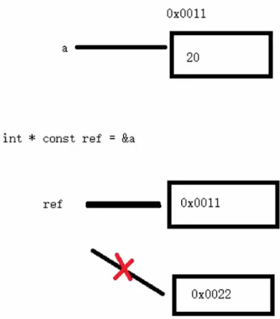

#  自己的知识点


返回值不可以作为重载的区分


## 引用

本质：**引用的本质在c++内部实现是一个指针常量.**
$\textcolor{red}{指针常量：指针的指向不可修改，指针指向的值是可以改变的}$

```C++
//发现是引用，转换为 int* const ref = &a;
void func(int& ref){
	ref = 100; // ref是引用，转换为*ref = 100
}
int main(){
	int a = 10;
    
    //自动转换为 int* const ref = &a; 指针常量是指针指向不可改，也说明为什么引用不可更改
	int& ref = a; 
	ref = 20; //内部发现ref是引用，自动帮我们转换为: *ref = 20;
    
	cout << "a:" << a << endl;
	cout << "ref:" << ref << endl;
    
	func(a);
	return 0;
}
```




## new , delete

堆区程序员手动开辟，也需要手动释放，不delete掉的话会造成内存泄漏

利用new创建的数据，会返回该数据对应的类型的指针

```cpp
//利用new关键字  可以将数据开辟到堆区
//利用new创建的数据，会返回该数据对应的类型的指针
//指针  本质也是局部变量，放在栈区，指针保存的数据是放在堆区
int* a = new int(10);

//释放
delete a;

//释放数组 delete 后加 []
delete[] arr;
```

指针：本质也是局部变量，放在栈区
指针保存的数据放在堆区

当我们使用未初始化内存的指针时：
会导致程序无法进行，因为指针并没有指向一个合法的地址，这时候其内部存的只是一些乱码，所以在调用函数时，会使用乱码所指的内存，指针根本就无权访问，导致出错。
解决办法：new 为指针动态分配内存，之后再用delete将其释放


容器中*it是什么是

```cpp
for (vector<int>::iterator it = v.begin(); it != v.end(); it++) {
        //*it就是int
		cout << *it << " ";
	}


```


## STL

### vector容器


### set容器

- 所有元素插入时都会被自动排序，默认从小到大
- 容器内的各个元素都互不相等

### unordered_set容器

- 等价为无序的set_容器

### map容器

- map中所有的元素都是pair
- pair中第一个元素为key（键值），起到索引作用，第二个元素为value（实值）
- 所有元素都会根据元素的键值自动排序

### unordered_map容器

- 等价为无序的map容器，其它都一样

### stack容器

- stack是一种**先进后出**(First in Last Out)的数据结构，它只有一个出口

 构造函数：

- `stack<T> stk;`                                 //stack采用模板类实现， stack对象的默认构造形式
- `stack(const stack &stk);`            //拷贝构造函数

赋值操作：

- `stack& operator=(const stack &stk);`           //重载等号操作符

数据存取：

- `push(elem);`      //向栈顶添加元素
- `pop();`                //从栈顶移除第一个元素
- `top(); `                //返回栈顶元素

大小操作：

- `empty();`            //判断堆栈是否为空
- `size(); `              //返回栈的大小

### queue容器

Queue是一种**先进先出**（First In First Out，FIFO）的数据结构

构造函数：

- `queue<T> que;`                                 //queue采用模板类实现，queue对象的默认构造形式
- `queue(const queue &que);`            //拷贝构造函数

赋值操作：

- `queue& operator=(const queue &que);`           //重载等号操作符

数据存取：

- `push(elem);`                             //往队尾添加元素
- `pop();`                                      //从队头移除第一个元素
- `back();`                                    //返回最后一个元素
- `front(); `                                  //返回第一个元素

大小操作：

- `empty();`            //判断堆栈是否为空
- `size(); `              //返回栈的大小

## STL-函数对象

### 1 函数对象

#### 1.1 函数对象概念

**概念：**

- 重载**函数调用操作符**的类，其对象常称为**函数对象**
- **函数对象**使用重载的()时，行为类似函数调用，也叫**仿函数**

**本质：**

函数对象(仿函数)是一个**类**，不是一个函数

#### 1.2  函数对象使用

**特点：**

- 函数对象在使用时，可以像普通函数那样调用, 可以有参数，可以有返回值
- 函数对象超出普通函数的概念，函数对象可以有自己的状态
- 函数对象可以作为参数传递


### 2  谓词

#### 2.1 谓词概念

**概念：**

- 返回bool类型的仿函数称为**谓词**
- 如果operator()接受一个参数，那么叫做一元谓词
- 如果operator()接受两个参数，那么叫做二元谓词


## 指针

### 指针与常量

```cpp
int x;
int * p1 = &x; //指针可以被修改，值也可以被修改
const int * p2 = &x; //指针可以被修改，值不可以被修改（const int），常量指针
int * const p3 = &x; //指针不可以被修改（* const），值可以被修改，指针常量
const int * const p4 = &x; //指针不可以被修改，值也不可以被修改
```

### 指针函数与函数指针

```cpp
// addition是指针函数，一个返回类型是指针的函数
int* addition(int a, int b) {
	int* sum = new int(a + b);
	return sum;
}
int subtraction(int a, int b) {
	return a - b;
}
int operation(int x, int y, int (*func)(int, int)) {
	return (*func)(x, y);
}

int* m = addition(1, 2);
// minus是函数指针，指向函数的指针
int (*minus)(int, int) = subtraction;
int n = operation(3, *m, minus);
```

### 指向指针的引用

在函数调用时用指针或者引用做参数，表示把变量的地址传递给子函数，
但是子函数只能修改指针所指变量的值，并不能修改指针的指向。
==如果想要修改指针的指向，就要用指针的指针，或者指针的引用。==


## 其他知识点

return static_cast<bool>(L.length);  //c++运算符，类型转换，将一个表达式转换为某种类型，但没有运行时的类型检查来保证转换的安全


 cerr<<"error"<<endl;  //输出到标准错误的ostream对象，常用于程序错误信息；


size_t：size type，一种用来记录大小的数据类型，表示C中任何对象所能达到的最大长度，它是无符号整数。size_t在32位系统上定义为 unsigned int，也就是32位无符号整型，4字节。在64位系统上定义为 unsigned long ，也就是64位无符号整形，8字节。


在C语言中，NULL：
是一个宏，被定义为空指针，定义如下：#define NULL ((void *)0) 
NULL实际上是一个空指针，如果在C语言中写入以下代码，编译是没有问题的，因为在C语言中把空指针赋给int和char指针的时候，发生了隐式类型转换，把void指针转换成了相应类型的指针。

```c
int  *pi = NULL;
char *pc = NULL;
```

C++程序中的NULL，因为C++是强类型语言，void*是不能隐式转换成其他类型的指针的，所以实际上编译器提供的头文件做了相应的处理：

```cpp
#ifdef __cplusplus
#define NULL 0
#else
#define NULL ((void *)0)
#endif
```

可见，在C++中，NULL实际上是0。因为C++中不能把void*类型的指针隐式转换成其他类型的指针，所以为了结果空指针的表示问题，C++引入了0来表示空指针，这样就有了上述代码中的NULL宏定义。
但是实际上，用NULL代替0表示空指针在函数重载时会出现问题，程序执行的结果会与我们的想法不同，举例如下：

```cpp
#include <iostream>
using namespace std;
 
void func(void* i)
{
	cout << "func1" << endl;
}
 
void func(int i)
{
	cout << "func2" << endl;
}
 
void main(int argc,char* argv[])
{
	func(NULL);
	func(nullptr);
	getchar();
}
```


在这段代码中，我们对函数func进行可重载，参数分别是void*类型和int类型，但是运行结果却与我们使用NULL的初衷是相违背的，因为我们本来是想用NULL来代替空指针，但是在将NULL输入到函数中时，它却选择了int形参这个函数版本，所以是有问题的，这就是用NULL代替空指针在C++程序中的二义性。

为解决NULL代指空指针存在的二义性问题，在C++11版本(2011年发布)中特意引入了nullptr这一新的关键字来代指空指针，从上面的例子中我们可以看到，使用nullptr作为实参，确实选择了正确的以void*作为形参的函数版本。

**总结：**NULL在C++中就是0，这是因为在C++中void* 类型是不允许隐式转换成其他类型的，所以之前C++中用0来代表空指针，但是在重载整形的情况下，会出现上述的问题。所以，C++11加入了nullptr，可以保证在任何情况下都代表空指针，而不会出现上述的情况，因此，建议以后还是都用nullptr替代NULL吧，而NULL就当做0使用。


### auto

就是根据后面的值，来自己推测前面的类型是什么。
作用就是为了简化变量初始化，如果这个变量有一个很长很长的初始化类型，就可以用auto代替。
用auto声明的变量必须初始化（auto是根据后面的值来推测这个变量的类型，如果后面没有值，自然会报错）


C++的for循环中++i和i++的区别：
最终输出的结果没有区别。
二者的实现代码如下：

```cpp
   A  operator ++()         //前++
    {
        i=i+1;
        return *this;
    }
 
    A  operator ++(int)      //后++
    {
        A t=*this;          //先保存一份变量
        ++(*this);          //调用前++
        return t;
     }
```

可以发现，i++需要一个暂时变量，然后将i加1后，返回的是暂时变量。而++i就是自增后返回i。
所以在**空间损耗**上，**i++要略高于++i**，因此，**在不影响代码逻辑的前提下，要尽量使用++i**。


在C++中，
如果是int，可以用INT_MAX表示正无穷，INT_MIN表示负无穷，需要包含limits.h。
如果是double，可以用DBL_MAX表示正无穷，-DBL_MAX表示负无穷(注意不是DBL_MIN)，需要包含float.h。


# 常用实例 

## 1、函数与库的对应

1、max()、min()、abs()、swap()、reverse()、sort()、find()、count()在<algorithm>

2、内建函数对象，greater<>()、less<>()在<functional>

3、accumulate在<numeric>

4、unordered_map在<unordered_map>，unordered_set在<unordered_set>

## 2、常用操作

bool型数据输出true/false，而并不是1/0

```cpp
cout << boolalpha << ss.search(nums, target) << endl;
```


字符空格用‘ ’表示


## 3、数组

### 动态创建数组并输出

```cpp
int n;   //输入数组长度
cin >> n;
int* p;  //声明一个指针
p = new int[n]; /*创建了一个长度为n的动态数组，并且返回这个数组的首地址给p，p就指向了这个动态数组，可以通过指针p来操作数组，因为创建的动态数组并没有名字，只返回了首地址给p，所以可以把p看作是这个动态数组的名字 */
for (int i = 0; i < n; i++) {
	cin >> p[i];
}
for (int i = 0; i < n; i++) {
    cout << p[i] << " ";
}
delete[]p;  //释放这个一维的动态数组，而不是释放指针p。用完以后要记得释放掉
```

```cpp
//无注释版
int n;
cin >> n;
int* p = new int[n];
for (int i = 0; i < n; i++) {
	cin >> p[i];
}
for (int i = 0; i < n; i++){
    cout << p[i] << " ";
}
delete[]p;
```


## 4、vector

### vector创建不定长的一组数据

```cpp
vector<int> createVector() {
	vector<int> ivec;
	int num;
	do
	{
		cin >> num;
		ivec.push_back(num);
	} while (getchar() != '\n'); //检测到换行键时，停止输入
	return ivec;
}
//返回值vector<int>是要返回vector容器，int则是返回整数

vector<int> createVector() {
	vector<int> nums;
	int tmp;
	while(cin >> tmp){
		nums.push_back(tmp);
		if(cin.get() == '\n') break;
	}
	return nums;
}
```

> 注：
> a. 以空格为间隔输入数组
> b. 输入完成，回车必须紧跟最后一个数字，若回车前是空格，则此回车会像空格一样被忽略

### 手动创建vector容器嵌套容器

```cpp
int main()
{
	vector<vector<int>> intervals = { {1, 2},{2, 3},{3, 4},{1, 3} };
	printVectorInVector(intervals);

	system("pause");
	return 0;
}
```

### vector容器打印

```cpp
void printVector(vector<int>& v) {
    for (vector<int>::iterator it = v.begin(); it != v.end(); it++) {
        cout << *it << " ";
    }
    cout << endl;
}

void printVector(vector<int>& v) {
    for (int i = 0; i<v.size(); ++i) {
        cout << v[i] << " ";
    }
    cout << endl;
}
```

### vector容器嵌套容器的打印

```cpp
void printVectorInVector(vector<vector<int>>& v) {
	//通过大容器，把所有数据遍历一遍
	for (vector<vector<int>>::iterator it = v.begin(); it != v.end(); it++) {
		//(*it) ---- 容器 vector<int>
		for (vector<int>::iterator vit = (*it).begin(); vit != (*it).end(); vit++) {
			cout << *vit << " ";
		}
		cout << endl;
	}
	//每一个小容器输出，输出完了做一个换行的操作
}
```

## 5、字符串

### 输入一个不带空格的字符串

```c++
string str;
cin >> str;
```

### 输入一个带空格的字符串

```cpp
string str;
getline(cin, str);
```


## 6、链表

### 尾插法创建不定长的单向链表（带头结点）

```cpp
//尾插法创建不定长的单向链表（带头结点）
void createListTail(ListNode* L) {
    //r、L指向头结点
	ListNode* r = L;
	do {
		ListNode* p = new ListNode;
		cin >> p->val;  //循环创建p，输入结点数据
		p->next = nullptr;
		r->next = p;
		r = p;
	} while (getchar() != '\n');
}
```

### 尾插法创建不定长的单向链表（不带头结点）

```cpp
//不带头结点
void createListTail(ListNode* L) {
    //r、L直接指向首元结点而不是头结点
	ListNode* r = L;
    //第一次先输入首元结点的数据
	cin >> r->val;
	do {
		ListNode* p = new ListNode;
		cin >> p->val;  //循环创建p，输入结点数据
		p->next = nullptr;
		r->next = p;
		r = p;
	} while (getchar() != '\n');
}
```

```cpp
//尾插法创建不定长的单向链表
//不带头结点
//返回值类型直接为ListNode*
ListNode* createListTail() {
	ListNode* L= new ListNode;
	ListNode* r = L;
	cin >> r->val;
	do {
		ListNode* p = new ListNode;
		cin >> p->val;  //循环创建p，输入结点数据
		p->next = nullptr;
		r->next = p;
		r = p;
	} while (getchar() != '\n');
	return L;
}

//new出来的L，并且返回了，记得delete掉
delete L;
```


### 输出链表元素（带头结点）

```cpp
//输出链表元素
void printList(ListNode* L) {
	ListNode* p = L->next;
	while (p) {
		cout << p->val<<" ";
		p = p->next;
	}
	cout << endl;
}
```

### 输出链表元素（不带头结点）

```cpp
//输出链表元素
void printList(ListNode* L) {
	ListNode* p = L->next;
	while (p) {
		cout << p->val<<" ";
		p = p->next;
	}
	cout << endl;
}
```

## 7、树

### 根据数组，层次法创建二叉树

```cpp
#include <vector>

//根据数组，层次法创建二叉树
TreeNode* createTree(vector<int>& l_nums, int i) //层次法创建二叉树
{
    if (i >= l_nums.size() || l_nums[i] == 0 ) //数值为0或超出数组范围
        return nullptr;
    TreeNode* root = new TreeNode(l_nums[i]);
    root->left = createTree(l_nums, i * 2 + 1);
    root->right = createTree(l_nums, i * 2 + 2);
    return root;
}

int main()
{
    //创建所使用的数组
    vector<int> nums = { 3,9,20,0,0,15,7 };
    TreeNode* root = createTree(nums, 0);
    levelOrderIter(root);

    system("pause");
    return 0;
}
```


### 二叉树的遍历，并输出

```cpp
#include <queue>

//层次遍历，迭代法
void levelOrderIter(TreeNode* root) {
    queue<TreeNode*> que;
    que.push(root);
    while (!que.empty()) {
        cout << que.front()->val << " ";
        if (que.front()->left != nullptr) {
            que.push(que.front()->left);
        }
        if (que.front()->right != nullptr) {
            que.push(que.front()->right);
        }
        que.pop();
    }
    cout << endl;
}

int main()
{
    vector<int> nums = { 3,9,20,0,0,15,7 };
    TreeNode* root = createTree(nums, 0);
    levelOrderIter(root);

    system("pause");
    return 0;
}
```

