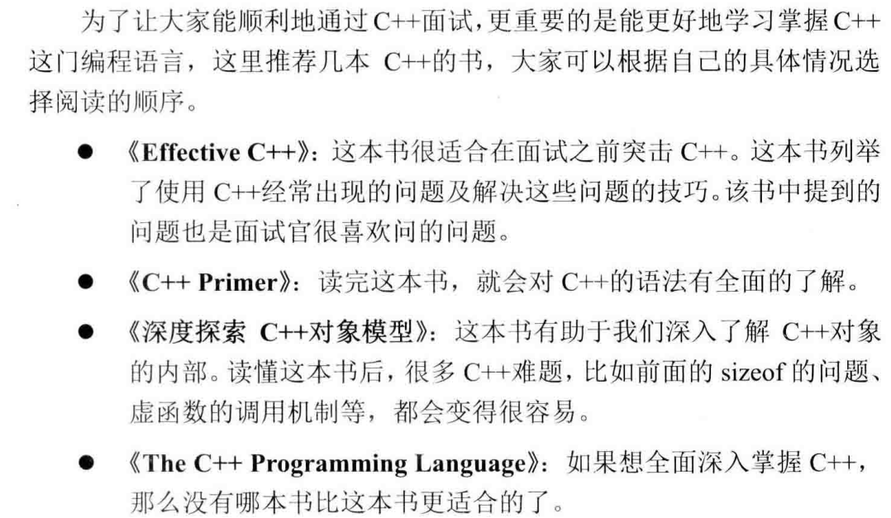

# 数据结构

​        数组和字符串是两种最基本的数据结构，它们用连续内存分别存储数字和字符。
​		链表和树是面试中出现频率最高的数据结构。由于操作树需要操作大量的指针，应聘者在解决相关问题的时候一定要留意鲁棒性，否则容易出现程序崩溃的问题。
​		栈是一个与递归紧密相关的数据结构，同样队列也与广度优先遍历算法紧密相关，深刻理解这两种数据结
构能帮助我们解决很多算法问题。

## 数组

​		为了解决数组空间效率不高的问题，人们又设计实现了多种动态数组，比如C++的STL 中的 vector。为了避免浪费，我们先为数组开辟较小的空间，然后往数组中添加数据。当数据的数目超过数组的容量时，我们再重新分配一块更大的空间(STL的 vector 每次扩充容量时，新的容量都是前一次的两倍)，把之前的数据复制到新的数组中，再把之前的内存释放，这样就能减少内存的浪费。==但我们也注意到每一次扩充数组容量时都有大量的额外操作，这对时间性能有负面影响，因此使用动态数组时要尽量减少改变数组容量大小的次数。==

​		当我们声明一个数组时，数组的名字也是一个指针，该指针指向数组的第一个元素。C/C++没有记录数组的大小，因此在用指针访问数组中的元素是，要确保没有超出数组的边界。


```
输出“20,4,4”
data1是一个数组，sizeof(data1)是求数组的大小，数组包含5个整数，每个整数4字节，一共20字节
data2声明为指针，32位系统上，对任意指针求sizeof，得到的结果都是4
C/C++中，数组最为函数的参数进行传递时，数组会自动退化成同类型的指针，所以size3也为4
```

### 3 、数组中重复的数字

#### 方法一：哈希表

```cpp
class Solution {
public:
	int findRepeatNumber(vector<int>& nums) {
		//哈希表记录数组中的各个数字
		unordered_map<int, bool> map;
		//遍历数组nums中的每个数字num
		for (auto num : nums) {
			//当num在哈希表中，说明重复，直接返回num
			if (map[num]) {
				return num;
			}
			//将num添加至哈希表中
			map[num] = true;
		}
		return -1;
	}
};
```

### 4、二维数组中的查找

#### 方法一：标志数

```cpp
class Solution {
public:
	bool findNumberIn2DArray(vector<vector<int>>& matrix, int target) {
		int i = matrix.size() - 1;
		int j = 0;
		while (i >= 0 && j <matrix[0].size()) {
			//如果当前值大于target，则target一定在当前值的行上方，--i消去当前行
			if (matrix[i][j] > target) {
				--i;
			}
			//当前值小于target，则target一定在当前值的列右方，++j消去当前列
			else if (matrix[i][j] < target) {
				++j;
			}
			else {
				return true;
			}
		}
		return false;
	}
};
```

## 字符串

### 5、替换空格

#### 方法一：原地修改

- 初始化：空格数量 count ，字符串 s 的长度 len ；
- 统计空格数量：遍历 s ，遇空格则 count++ ；
- 修改 s 长度：添加完 "%20" 后的字符串长度应为 len + 2 * count ；
- 倒序遍历修改：i 指向原字符串尾部元素， j 指向新字符串尾部元素；当 i = j 时跳出（代表左方已没有空格，无需继续遍历）；
  1）当 s[i] 不为空格时：执行 s[j] = s[i] ；
  2）当 s[i] 为空格时：将字符串闭区间 [j-2, j] 的元素修改为 "%20" ；由于修改了 3 个元素，因此需要 j -= 2 ；
- 返回值：已修改的字符串 s ；

```cpp
class Solution {
public:
    string replaceSpace(string s) {
        int count = 0, len = s.size();
        // 统计空格数量
        for (char c : s) {
            if (c == ' ') count++;
        }
        // 修改 s 长度
        s.resize(len + 2 * count);
        // 倒序遍历修改
        for (int i = len - 1, j = s.size() - 1; i < j; i--, j--) {
            if (s[i] != ' ')
                s[j] = s[i];
            else {
                s[j - 2] = '%';
                s[j - 1] = '2';
                s[j] = '0';
                j -= 2;
            }
        }
        return s;
    }
};
```

## 链表

### 6、从尾到头打印链表

#### 方法一：栈

后进先出，可以选择栈作为数据结构

```cpp
class Solution {
public:
	vector<int> reversePrint(ListNode* head) {
		ListNode* temp = head;
		stack<int> s;
		vector<int> v;
		while (temp != nullptr) {
			s.push(temp->val);
			temp = temp->next;
		}

		while (!s.empty()) {
			v.push_back(s.top());
			s.pop();
		}
		return v;
	}
};
```

### 24、反转链表

#### 方法一：迭代

```cpp
class Solution {
public:
	ListNode* reverseList(ListNode* head) {
		ListNode* curr = head;
		ListNode* prev = nullptr;

		while (curr) {
			ListNode* temp = curr->next;
			curr->next = prev;
			prev = curr;
			curr = temp;
		}
		return prev;
	}
};
```

### 24、合并两个排序的链表

#### 方法一：递归

```cpp
class Solution {
public:
	ListNode* mergeTwoLists(ListNode* l1, ListNode* l2) {
		if (l1 == nullptr) {
			return l2;
		}
		else if (l2 == nullptr) {
			return l1;
		}
		
		if (l1->val < l2->val) {
			l1->next = mergeTwoLists(l1->next, l2);
			return l1;
		}
		else {
			l2->next = mergeTwoLists(l1, l2->next);
			return l2;
		}
	}
};
```

### 52、两个链表的第一个公共结点

#### 方法一：双指针

```cpp
class Solution {
public:
    ListNode* getIntersectionNode(ListNode* headA, ListNode* headB) {
		ListNode* curA = headA;
		ListNode* curB = headB;
		while (curA != curB) {
			curA = curA ? curA->next : headB;
			curB = curB ? curB->next : headA;
		}
		return curA;
    }
};
```

### II 22、链表中环的入口结点

#### 方法一：哈希表

```cpp
class Solution {
public:
	ListNode* detectCycle(ListNode* head) {
		unordered_set<ListNode*> uset;
		ListNode* cur = head;
		while (cur != nullptr) {
            //一旦遇到了此前遍历过得结点，说明有换，并返回该结点
			if (uset.count(cur)) {
				return cur;
			}
			uset.insert(cur);
			cur = cur->next;
		}
		return nullptr;
	}
};
```

### 22、链表中倒数第k个结点

#### 方法一：双指针

1. 后一个指针先走k步
2. 然后两个指针一起走，直到后一个指针为空
3. 返回前一个指针

```cpp
class Solution {
public:
	ListNode* getKthFromEnd(ListNode* head, int k) {
		ListNode* former = head, * latter = head;
		for (int i = 1; i <= k; ++i) {
			latter = latter->next;
		}

		while (latter != nullptr) {
			latter = latter->next;
			former = former->next;
		}
		return former;
	}
};
```

### 18、删除链表的结点

#### 方法一：两个指针

1. 特例处理： 当应删除头节点 head 时，直接返回 head.next 即可。
2. 初始化： `pre = head` , `cur = head.next` 。
3. 定位节点： 当 cur 为空 或 cur 节点值等于 val 时跳出。
   1. 保存当前节点索引，即 `pre = cur` 。
   2. 遍历下一节点，即 `cur = cur.next` 。
4. 删除节点： 若 `cur` 指向某节点，则执行 `pre.next = cur.next` ；若 `cur` 指向 `null`，代表链表中不包含值为 `val` 的节点。
5. 返回值： 返回链表头部节点 `head` 即可


```cpp
class Solution {
public:
	ListNode* deleteNode(ListNode* head, int val) {
		if (head->val == val) {
			return head->next;
		}
		ListNode* cur = head, * pre = head;
		while (cur->next != nullptr && cur->val != val) {
			pre = cur;
			cur = cur->next;
		}
		if (cur != nullptr) {
			pre->next = cur->next;
		}
		return head;
	}
};
```


## 树

### 55、二叉树的深度

#### 方法一：递归

```cpp
class Solution {
public:
    int maxDepth(TreeNode* root) {
        //当root为空，说明已经越过叶子结点，返回深度0
        if (!root) {
            return 0;
        }
        //本质上是后序遍历
        //递归计算右子树和左子树的深度
        return max(maxDepth(root->left), maxDepth(root->right)) + 1;
    }
};
```

### 27、二叉树的镜像

#### 方法一：写得很差的递归

```cpp
class Solution {
public:
    TreeNode* mirrorTree(TreeNode* root) {
        if (root == nullptr) {
            return nullptr;
        }
        TreeNode* temp = root->left;
        root->left = root->right;
        root->right = temp;
        if (root->left) {
            mirrorTree(root->left);
        }
        if (root->right) {
            mirrorTree(root->right);
        }
        return root;
    }
};
```

### 32、从上到下打印二叉树

#### 方法一：层次遍历

用栈来实现层次遍历（做了几次之后，已经比较简单了）

```cpp
class Solution {
public:
    vector<int> levelOrder(TreeNode* root) {
        queue<TreeNode*> q;
        vector<int> v;
        if (root == nullptr) {
            return v;
        }
        q.push(root);
        while (!q.empty()) {
            v.push_back(q.front()->val);
            if (q.front()->left != nullptr) {
                q.push(q.front()->left);
            }
            if (q.front()->right != nullptr) {
                q.push(q.front()->right);
            }
            q.pop();
        }
        return v;
    }
};
```


## 动态规划

