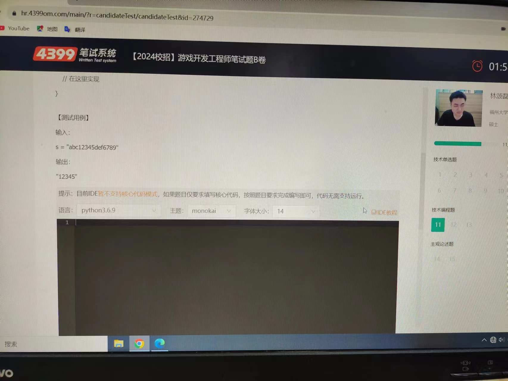

## 1、在字符串中找出连续最长的数字串




```cpp
#include <iostream>
#include <string>
std::string findLongestIncreasingDigitsSubstr(const std::string& s) {
    int n = s.length();
    int maxLen = 0; // 最大子串长度
    int startPos = 0; // 最大子串起始位置
    int i = 0;
    while (i < n - 1) {
        int len = 1; // 当前子串长度
        int start = i; // 当前子串起始位置
        // 判断是否是递增数字
        while (s[i] < s[i + 1] && isdigit(s[i]) && isdigit(s[i + 1]) && 
(s[i] - '0' == s[i +1] - '0' - 1)) {
            len++;
            i++;
        }
        // 如果当前子串长度大于最大子串长度，则更新最大子串信息
        if (len > maxLen) {
            maxLen = len;
            startPos = start;
        }
        i++;
    }
    // 提取最长递增子串并返回
    return s.substr(startPos, maxLen);
}
int main() {
    const std::string s = "abc12334def126789";
    std::string longestSubstr = findLongestIncreasingDigitsSubstr(s);
    std::cout << "最长递增子串：" << longestSubstr << std::endl;
    return 0;
}

```


## 2、


```cpp
#include <iostream>
#include <vector>
#include <string>
#include <algorithm>

using namespace std;

// 树节点的定义
struct TreeNode {
    int val;
    TreeNode* left;
    TreeNode* right;
    TreeNode(int x) : val(x), left(NULL), right(NULL) {}
};

// 递归构造二叉树
TreeNode* constructTree(vector<int>& nums, int index) {
    if (index >= nums.size() || nums[index] == -1) {
        return NULL;
    }

    TreeNode* node = new TreeNode(nums[index]);
    node->left = constructTree(nums, 2 * index + 1);
    node->right = constructTree(nums, 2 * index + 2);

    return node;
}

// 获取从叶节点到根节点的最小字符串
void getSmallestString(TreeNode* root, string path, string& smallest) {
    if (root == NULL) {
        return;
    }

    // 叶节点，更新最小字符串
    if (root->left == NULL && root->right == NULL) {
        path += 'a' + root->val;  // 将数字转换为对应的字符
        reverse(path.begin(), path.end()); // 反转字符串
        if (path < smallest) {
            smallest = path;
        }
        return;
    }

    // 遍历左子树和右子树
    getSmallestString(root->left, path + (char)('a' + root->val), smallest);
    getSmallestString(root->right, path + (char)('a' + root->val), smallest);
}

// 返回字典序最小的字符串
string getSmallestString(vector<int>& nums) {
    TreeNode* root = constructTree(nums, 0);
    string smallest = string(26, 'z');  // 初始化为一个较大的值
    getSmallestString(root, "", smallest);
    return smallest;
}

int main() {
    vector<int> nums = { 0, 1, 2, 3, 4, 3, 4 };
    string smallestStr = getSmallestString(nums);
    cout << smallestStr << endl;

    nums = { 25, 1, 3, 1, 3, 0, 2 };
    smallestStr = getSmallestString(nums);
    cout << smallestStr << endl;

    nums = { 2, 2, 1, -1, 1, 0, -1, 0 };
    smallestStr = getSmallestString(nums);
    cout << smallestStr << endl;

    return 0;
}


```


## 3、


```cpp
#include <iostream>
#include <vector>

using namespace std;

class Solution {
public:
    void startGame(vector<int> list, int n, int m) {
        vector<vector<int>> grid(n, vector<int>(n, 0));  // 创建二维数组表示细胞状态

        // 初始细胞状态，将list中的细胞设置为存活
        for (int cell : list) {
            int row = (cell - 1) / n;
            int col = (cell - 1) % n;
            grid[row][col] = 1;
        }

        // 定义方向数组，用于遍历细胞周围的邻格
        int dx[] = { -1, -1, -1, 0, 0, 1, 1, 1 };
        int dy[] = { -1, 0, 1, -1, 1, -1, 0, 1 };

        for (int k = 0; k < m; k++) {
            vector<vector<int>> newGrid(n, vector<int>(n, 0));  // 用于存储下一时刻的状态

            // 模拟细胞演化
            for (int i = 0; i < n; i++) {
                for (int j = 0; j < n; j++) {
                    int liveNeighbors = 0;  // 统计存活邻格数量

                    for (int dir = 0; dir < 8; dir++) {
                        int ni = i + dx[dir];
                        int nj = j + dy[dir];

                        if (ni >= 0 && ni < n && nj >= 0 && nj < n && grid[ni][nj] == 1) {
                            liveNeighbors++;
                        }
                    }

                    if (grid[i][j] == 1) {
                        // 存活细胞的规则
                        if (liveNeighbors < 2 || liveNeighbors > 3) {
                            newGrid[i][j] = 0;  // 过于孤独或拥挤，死亡
                        } else {
                            newGrid[i][j] = 1;  // 继续存活
                        }
                    } else {
                        // 死亡细胞的规则
                        if (liveNeighbors == 3) {
                            newGrid[i][j] = 1;  // 死而复生
                        }
                    }
                }
            }

            // 更新当前细胞状态
            grid = newGrid;
        }

        // 输出存活细胞序号
        vector<int> result;
        for (int i = 0; i < n; i++) {
            for (int j = 0; j < n; j++) {
                if (grid[i][j] == 1) {
                    int cellNumber = i * n + j + 1;
                    result.push_back(cellNumber);
                }
            }
        }

        // 输出结果
        if (result.size() < 50) {
            for (int cellNumber : result) {
                cout << cellNumber << " ";
            }
        } else {
            cout << "存活细胞数量超过50个，无法输出列表。";
        }
    }
};

int main() {
    Solution solution;
    vector<int> list1 = {1, 2, 3, 4, 5};
    int n1 = 5, m1 = 1;
    solution.startGame(list1, n1, m1);
    
    cout << endl;

    vector<int> list2 = {10, 14, 16, 21, 22};
    int n2 = 6, m2 = 4;
    solution.startGame(list2, n2, m2);

    return 0;
}

```

