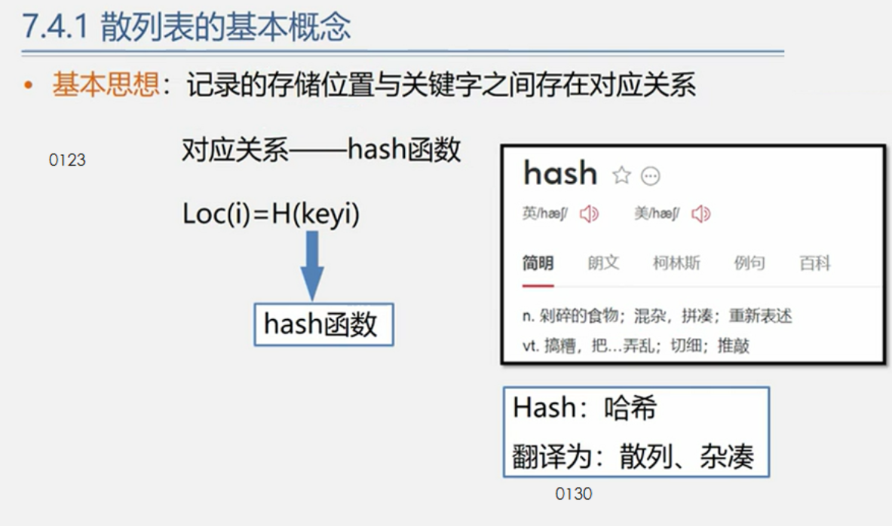
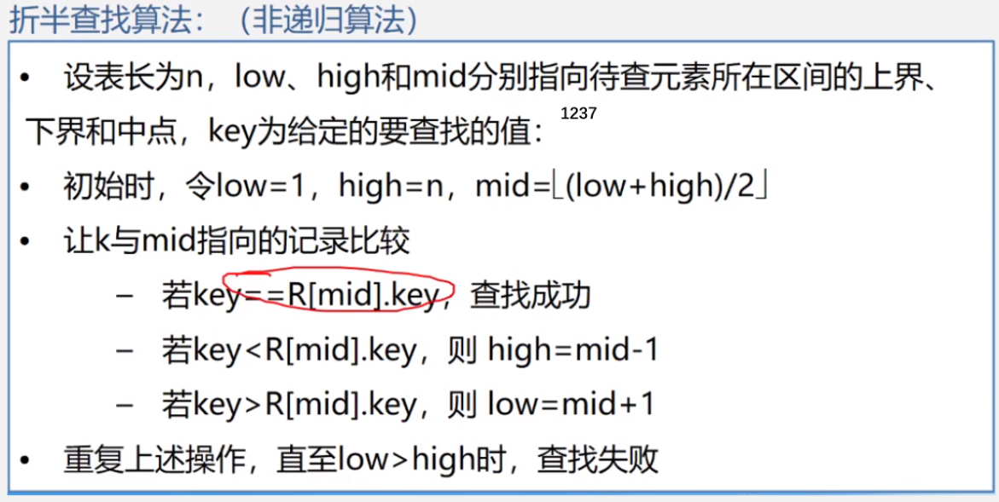
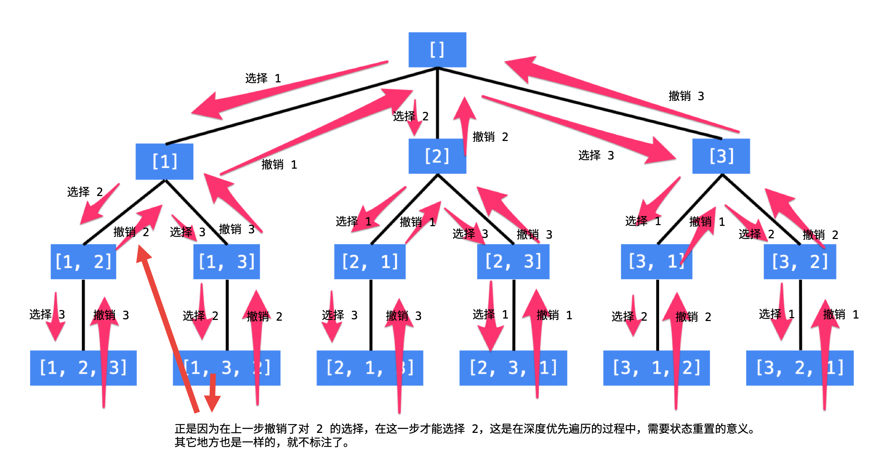

# 数据结构

## 链表

单链表：
常用操作 
指向头结点 p=L;
指向首元结点p=L->next;i=1; 
指向下一结点p=p->next;

## 哈希表

记录的存储位置与关键字之间存在对应关系

数组的下标设为哈希表的键值（Key），而数组中的每一个数字设为哈希表的值（Value），这样每一个下标及数组中该下标对应的数字就组成了一个“键值-值”的配对。有了这样的哈希表，就可以在O(1)的时间内实现查找。



一般用unordered_set和unordered_map容器实现，有需要“键值-值”的映射就用map

**unordered_set容器**

- 等价为无序的set_容器
- 容器内的各个元素都互不相等

**unordered_map容器**

- 等价为无序的map容器
- map中所有的元素都是pair
- pair中第一个元素为key（键值），起到索引作用，第二个元素为value（实值）


# 算法

## 最易懂的贪心算法

贪心算法或贪心思想采用贪心的策略，保证每次操作都是局部最优的，从而使最后得到的结果是全局最优的


## 双指针

- 双指针主要用于遍历数组，两个指针指向不同的元素，从而协同完成任务。也可以延伸到多个数组的多个指针。
- 若两个指针指向同一数组，遍历方向相同且不会相交，则也称为滑动窗口（两个指针包围的区域即为当前的窗口），经常用于区间搜索。
- 若两个指针指向同一数组，但是遍历方向相反，则可以用来进行搜索，待搜索的数组往往是排好序的。


## 二分查找




## 排序算法

### 快速排序（左闭右开）

```cpp
//左闭右开
void quick_sort(vector<int>& nums, int l, int r) {
	//如果数组大小为1，则无需排序
	if (l + 1 >= r) {
		return;
	}
	//因为传入的是nums.size()所以要减1
	int first = l, last = r - 1, key = nums[first];
	//确定中心点位置为first
	while (first < last) {
		while (first < last && nums[last] >= key) {
			--last;
		}
		//从后往前，找到比key值小的数，搬到first的位置
		nums[first] = nums[last];
		while (first < last && nums[first] <= key) {
			++first;
		}
		//从前往后，找到比key值大的数，搬到刚才空出来的last的位置
		nums[last] = nums[first];
	}
	//把key值赋给first位，此时的first=last
	nums[first] = key;
	//对低子表递归排序
	quick_sort(nums, l, first);
	//对高子表递归排序
	quick_sort(nums, first + 1, r);
	
}
```

### 归并排序

```cpp
//归并排序
void merge_sort(vector<int>& nums, int l, int r, vector<int>& temp) {
	if (l + 1 >= r) {
		return;
	}
	// divide
	int m = l + (r - l) / 2;
	merge_sort(nums, l, m, temp);
	merge_sort(nums, m, r, temp);
	// conquer
	int p = l, q = m, i = l;
	
	//将两个有序序列合并成一个有序序列
	while (p < m || q < r) {
		if (q >= r || (p < m && nums[p] <= nums[q])) {
			temp[i++] = nums[p++];
		}
		else {
			temp[i++] = nums[q++];
		}
	}
	for (i = l; i < r; ++i) {
		nums[i] = temp[i];
	}
}
```

## 搜索

### 深度优先搜索

前序遍历、中序遍历和后序遍历是三种利用深度优先搜索遍历二叉树的方式。
只是对结点访问的顺序有一点不同，其它完全相同。

### 回溯法

#### 回溯算法与深度优先遍历

采用试错的思想，它尝试分步的去解决一个问题。在分步解决问题的过程中，当它通过尝试发现现有的分步答案不能得到有效的正确的解答的时候，它将取消上一步甚至是上几步的计算，再通过其它的可能的分步解答再次尝试寻找问题的答案。回溯法通常用最简单的递归方法来实现，在反复重复上述的步骤后可能出现两种情况：

- 找到一个可能存在的正确的答案；
- 在尝试了所有可能的分步方法后宣告该问题没有答案。

**深度优先搜索** 算法（英语：Depth-First-Search，DFS）是一种用于遍历或搜索树或图的算法。这个算法会 **尽可能深** 的搜索树的分支。当结点 v 的所在边都己被探寻过，搜索将 **回溯** 到发现结点 v 的那条边的起始结点。这一过程一直进行到已发现从源结点可达的所有结点为止。如果还存在未被发现的结点，则选择其中一个作为源结点并重复以上过程，整个进程反复进行直到所有结点都被访问为止。

#### 与动态规划的区别

##### 共同点

用于求解多阶段决策问题。多阶段决策问题即：

- 求解一个问题分为很多步骤（阶段）；
- 每一个步骤（阶段）可以有多种选择。

##### 不同点

- 动态规划只需要求我们评估最优解是多少，最优解对应的具体解是什么并不要求。因此很适合应用于评估一个方案的效果；
- 回溯算法可以搜索得到所有的方案（当然包括最优解），但是本质上它是一种遍历算法，时间复杂度很高。




## 动态规划

​		这里我们引用一下维基百科的描述：“动态规划（Dynamic Programming, DP）在查找有很多==重叠子问题==的情况的最优解时有效。它将问题重新组合成子问题。为了避免多次解决这些子问题，它们的结果都逐渐被计算并被保存，从简单的问题直到整个问题都被解决。因此，动态规划保存递归时的结果，因而不会在解决同样的问题时花费时间 · · · · · ·动态规划只能应用于有==最优子结构==的问题。最优子结构的意思是局部最优解能决定全局最优解（对有些问题这个要求并不能完全满足，故有时需要引入一定的近似）。简单地说，问题能够分解成子问题来解决。”

​		通俗一点来讲，动态规划和其它遍历算法（如深/广度优先搜索）都是将原问题拆成多个子问题然后求解，他们之间最本质的区别是，==动态规划保存子问题的解，避免重复计算。==解决动态规划问题的关键是找到==状态转移方程====，这样我们可以通过计算和储存子问题的解来求解最终问题。==

​		同时，我们也可以对动态规划进行空间压缩，起到节省空间消耗的效果。

​		在一些情况下，动态规划可以看成是带有==状态记录==（memoization）的优先搜索。状态记录的意思为，如果一个子问题在优先搜索时已经计算过一次，我们可以把它的结果储存下来，之后遍历到该子问题的时候可以直接返回储存的结果。==动态规划是自下而上的，即先解决子问题，再解决父问题==；而==用带有状态记录的优先搜索是自上而下的，即从父问题搜索到子问题，若重复搜索到同一个子问题则进行状态记录，防止重复计算==。==如果题目需求的是最终状态，那么使用动态搜索比较方便；如果题目需要输出所有的路径，那么使用带有状态记录的优先搜索会比较方便。==


